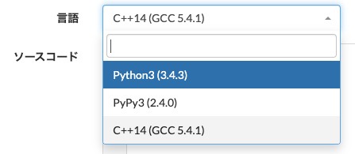

# AtCoder Language Filter

AtCoderにおいて，提出言語のフィルタリングと並び替えを行うUserScript．

以下の3つのページにて有効になります．

* 問題ページ : `*://atcoder.jp/contests/*/tasks/*`
* 提出ページ : `*://atcoder.jp/contests/*/submit*`
* コードテスト : `*://atcoder.jp/contests/*/custom_test*`

ご利用は**自己責任**でお願い致します．

## License

These codes are licensed under CC0.

